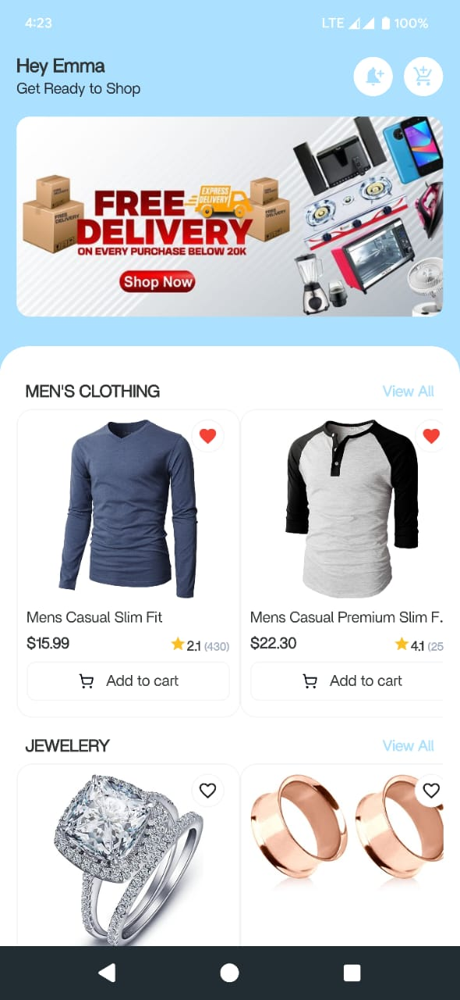
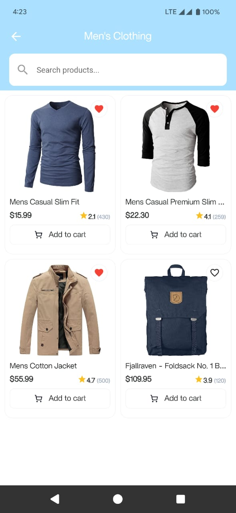
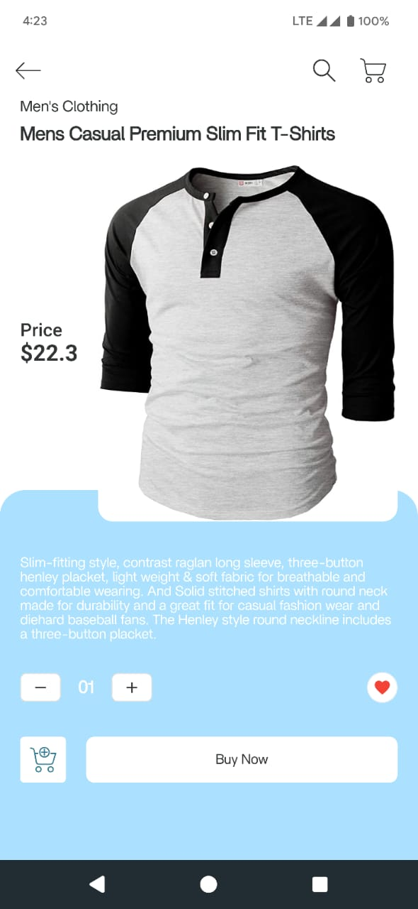

# 🛍️ Flutter Fake Store App

A simple e-commerce demo app built with Flutter 3.x. This app fetches product data from the [Fake Store API](https://fakestoreapi.com), displays products in a beautiful grid layout, and allows users to favorite items with local persistence.

---

## 📸 Screenshots

| Home Screen | All Product Screen | Product Detail Page |
|-------------|------------------|-------------------|
|  |  |  |

---

## 🚀 Features

- ✅ **Fetch product list** from [Fake Store API](https://fakestoreapi.com)
- ✅ Display products in a responsive **grid view**
- ✅ **Favorite products**, with local persistence using `SharedPreferences`
- ✅ **Category filtering** for better product discovery
- ✅ Smooth **animations** and **custom widgets** for a better user experience

---

## 📂 Project Structure

